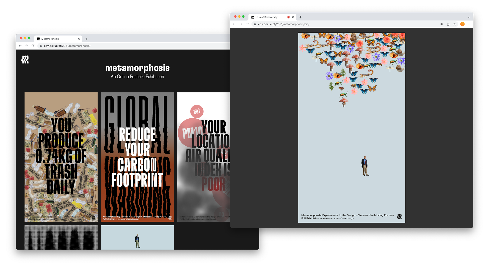

# Metamorphosis: Experiments in the Design of Interactive Moving Posters

**Metamorphosis** is a collection of interactive moving posters that address the current “metamorphosis” of the planet Earth due to the current climatic changes, _i.e._ the posters inform about the causes and consequences of some of the current environmental problems, especially focusing on human impact. 

Currently, the explored subjects are [Air Pollution](https://cdv.dei.uc.pt/2021/metamorphosis/AirPollution), [Biodiversity loss](https://cdv.dei.uc.pt/2021/metamorphosis/Bio/), [Deforestation](https://cdv.dei.uc.pt/2021/metamorphosis/Deforestation/), [Global Warming](https://cdv.dei.uc.pt/2021/metamorphosis/GlobalWarming/), [Noise Pollution](https://cdv.dei.uc.pt/2021/metamorphosis/NoisePollution/), [Water Pollution](https://cdv.dei.uc.pt/2021/metamorphosis/WaterPollution), and [Waste production](https://cdv.dei.uc.pt/2021/metamorphosis/WaterPollution).

*Screenshots of the developed online gallery presenting all the posters (left) and the interaction with the Loss of Diversity poster in an online environment (right).*

The online gallery collecting the developed posters is accessible at [cdv.dei.uc.pt/2021/metamorphosis](https://cdv.dei.uc.pt/2021/metamorphosis).

_Metamorphosis_ is a work-in-progress project. This way, some code optimisations and debugging may be necessary. Feel free to use and modify the code. Let us know if you have any issues or suggestions. 

#### Repository structure 

- `imgs` some screenshots of the project's setup and posters.
- `src` source code of the developed posters.

## Installation
_Metamorphosis_ still a work-in-progress project and code repository present a preliminary nature. This way, the posters could not run properly in your machine. Feel free to geting in touch with us if you have any issue. 

## Technologies
The presented poster designs were designed to be displayed both physically (_e.g._ in an outdoor interactive display) and virtually (_e.g._ on a dedicated online gallery). The only setup required is access to the captures of a webcam and microphone. The features of posters (_e.g._ format, size, elements placement position, etc.) were defined in a parametric manner.

### Dependencies
- [Distinct Faces From Pose Net](https://github.com/danifslopes/distinctFacesFromPoseNet) method
- [P5.js](https://p5js.org/) library was used for manipulating and rendering the posters.
- [ML5.js](https://ml5js.org/) library was used to facilitate access to Machine Learning models
- [Matter.js](https://brm.io/matter-js/) library was used as a physics engine. 

## Resources
- [Metamorphosis online gallery](https://cdv.dei.uc.pt/2021/metamorphosis)
- [Metamorphosis project page](https://cdv.dei.uc.pt/metamorphosis/)
- [Poster Factory](https://cdv.dei.uc.pt/posters-factory/) (related project)
- [Posters moving versions](https://cdv.dei.uc.pt/wp-content/uploads/2022/06/animated-versions.zip)
- [Supplementary images](https://cdv.dei.uc.pt/wp-content/uploads/2022/06/images.zip)

## Papers and Dissertation
- Gonçalves, R., Rebelo, S.M., Lopes, D., and Rebelo, A. (2022) [Promoting climate awareness through the design of interactive moving posters](https://doi.org/10.21606/drs.2022.741), in Lockton, D., Lenzi, S., Hekkert, P., Oak, A., Sádaba, J., Lloyd, P. (eds.), DRS2022: Bilbao, 25 June - 3 July, Bilbao, Spain. [https://doi.org/10.21606/drs.2022.741](https://doi.org/10.21606/drs.2022.741)
- Gonçalves, R. (2021). [Metamorphosis: Experiments in the Design of Interactive Moving Posters](https://estudogeral.uc.pt/handle/10316/98072) (MSc dissertation, Design and Multimedia, Universidade de Coimbra). [https://estudogeral.uc.pt/handle/10316/98072](https://estudogeral.uc.pt/handle/10316/98072)

## Team
- [Ricardo Gonçalves](https://github.com/Ricardo5cg) (concept, design and developement)
- [Sérgio M. Rebelo](https://github.com/sergiomrebelo/) (suport and supervision, `srebelo@dei.uc.pt`)
- [Daniel Lopes](https://github.com/danifslopes/) (suport and supervision, `dfl@dei.uc.pt`)
- [Artur Rebelo](https://cdv.dei.uc.pt/authors/artur-rebelo/) (supervision)

Work developed in the context of an MSc dissertation of [Ricardo Gonçalves](https://github.com/Ricardo5cg) in [Design and Multimédia](https://dm.dei.uc.pt/) of the University of Coimbra in the [CDV lab.](https://cdv.dei.uc.pt/) of [CMS/CISUC](https://www.cisuc.uc.pt/en).

#### Acknowledgements
This work is partially supported by national funds through the Foundation for Science and Technology (FCT), Portugal, within the scope of the project UID/CEC/00326/2019. [Sérgio M. Rebelo](https://github.com/sergiomrebelo/) is funded by FCT under the grant SFRH/BD/132728/2017 and COVID/BD/151969/2021. [Daniel Lopes](https://github.com/danifslopes/) is funded by FCT under the grant SFRH/BD/143553/2019.

## License
Usage is provided under the [MIT License](http://http//opensource.org/licenses/mit-license.php). 